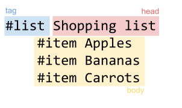

## Block tags

Each line of HashML has a tag. In the following, the first line is tagged as a `#list`; the following lines are tagged as `#item`:

```hashml
#list Shopping list
	#item Apples
	#item Bananas
	#item Carrots
```

A block tag can have a _head_ describing the item, and can have a _body_ indented under it:



The schema defines whether a block tag can have a head, and what items (if any) are allowed in its body.

## Inline tags

HashML also has support for inline tags, which can appear in the head of a block tag. The arguments of an inline tag are given in square brackets:

```
#paragraph Here's a #url[https://www.example.com][link to my website]!
```

The schema defines which inline tags are allowed in the head of a given block tag, how many arguments an inline tag has, and of what type

To avoid being too verbose, HashML supports syntactic sugar for common inline tags, much like Markdown. If the schema defines bacticks as syntactic sugar for `#code`, the following two lines are equivalent:

```hashml
Here's some #code[inline code]
Here's some `inline code`
```

## Default tags

Writing tags at the beginning of each line can be tedious:

```hashml
#list Shopping list
	#item Apples
	#item Bananas
	#item Carrots
```

To help with this situation, HashML supports default tags. For instance, if the schema for `#list` defines `#item` as its default tag, then the above can equivalently be written as:

```hashml
#list
	Apples
	Bananas
	Carrots
```

Default items can have default body items as well. For instance, if the schema defines the default for `#item` as `#item`, we can write nested lists:

```hashml
#list
	Fruits
		Apples
		Bananas
	Vegetables
		Carrots
```

## Raw tags

Sometimes, we'd like to write things that shouldn't be parsed by the HashML parser. This is the case for code, for instance: the indentation and hashtags shouldn't be understood by the parser as HashML code:

```hashml
#code python
	# This is a Python comment, not HashML markup!
	def test():
		print("hello world)
```

The schema allows us to define `#code` as a raw block, and then the above just works. This also works for inline tags: we can define `#code` as an inline tag taking a single raw argument:

```hashml
The schema allows us to define #code[#code] as a raw block
```

We can combine this with sugar for inline tags:

```hashml
The schema allows us to define `#code` as a raw block
```
